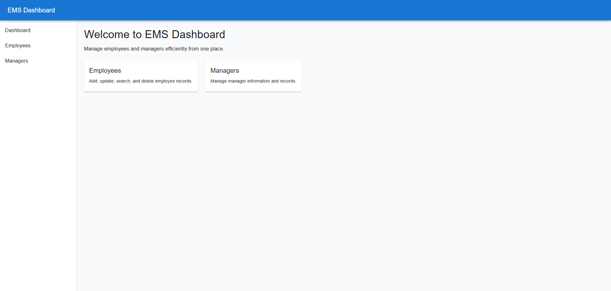
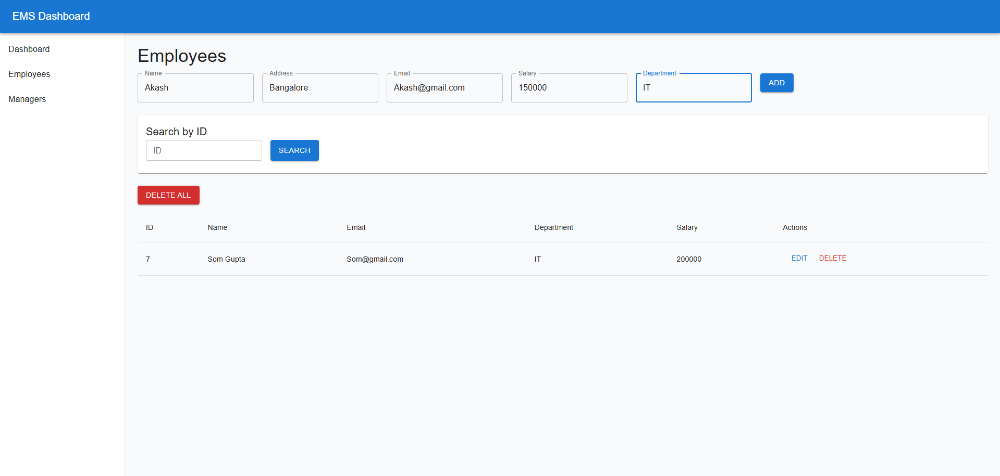
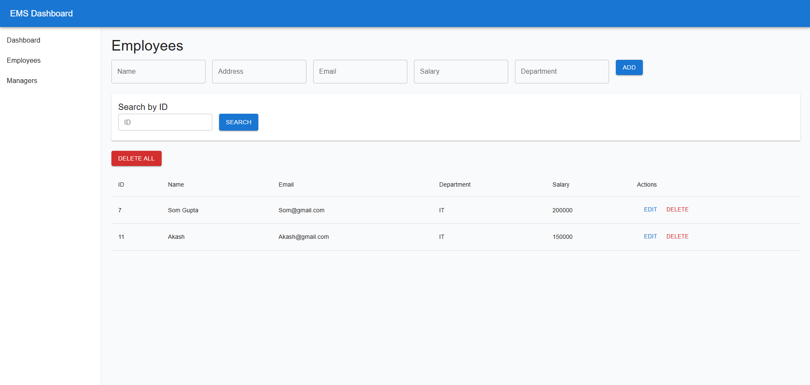

# Employee Management System (EMS)

A **full-stack Employee Management System** built using **Spring Boot** for backend REST APIs and **React + Material UI** for the frontend.  
This project demonstrates real-world CRUD operations, frontend–backend integration, and clean GitHub project structure.

---

## Tech Stack

### Backend
- Java 21
- Spring Boot
- Spring Data JPA
- Hibernate
- MySQL
- REST APIs
- Maven

### Frontend
- React (Vite)
- Material UI (MUI)
- Axios
- React Router DOM

### Tools & Platforms
- Git & GitHub
- VS Code / Eclipse / IntelliJ
- Postman

---

## Features

### Employee Module
- Add new employee
- Update employee details
- Get employee by ID
- Get all employees
- Delete employee by ID
- Delete all employees
- Search employee by ID with **OK / Delete** options
- Skeleton loaders for better UX
- Confirmation dialogs for delete actions

### Manager Module
- Add new manager
- Update manager details
- Get manager by ID
- Get all managers
- Delete manager by ID
- Delete all managers
- Search manager by ID with **OK / Delete** options
- Confirmation dialogs for delete actions

### Dashboard
- Clean sidebar-based layout
- Grid-based content layout
- Responsive UI using Material UI

---

## API Endpoints

### Employee APIs
| Method | Endpoint | Description |
|------|--------|-------------|
| POST | `/api/employees` | Create employee |
| GET | `/api/employees` | Get all employees |
| GET | `/api/employees/{id}` | Get employee by ID |
| PUT | `/api/employees/{id}` | Update employee |
| DELETE | `/api/employees/{id}` | Delete employee by ID |
| DELETE | `/api/employees/all` | Delete all employees |

### Manager APIs
| Method | Endpoint | Description |
|------|--------|-------------|
| POST | `/api/managers` | Create manager |
| GET | `/api/managers` | Get all managers |
| GET | `/api/managers/{id}` | Get manager by ID |
| PUT | `/api/managers/{id}` | Update manager |
| DELETE | `/api/managers/{id}` | Delete manager by ID |
| DELETE | `/api/managers/all` | Delete all managers |

---

## Project Structure
```
EMS-EmployeeManagementSystem
├── frontend/              # React + MUI frontend
│ ├── src/
│ ├── package.json
│ └── vite.config.js
├── src/                   # Spring Boot backend
│ └── main/java/com/som/ems
├── pom.xml
└── README.md
```
---

## Screenshots

### Dashboard


### Add / Update Employee


### Employees


### Managers


---
## Learning Outcomes
- Built real-world REST APIs using Spring Boot  
- Integrated React frontend with backend APIs  
- Implemented clean CRUD operations  
- Learned GitHub monorepo management  
- Improved UI/UX using Material UI  

---

## Author
**Som Gupta**  
GitHub: https://github.com/somguptaa  

---

## Future Enhancements
- Authentication & Authorization (JWT)  
- Role-based access (Admin / Manager)  
- Pagination & sorting  
- Deployment using Docker or Cloud platforms  
- Unit and integration testing  

---


## Licence
- Released Under <a href="https://github.com/somguptaa/EMS-EmployeeManagementSystem/blob/main/LICENSE"> MIT Licence </a>
